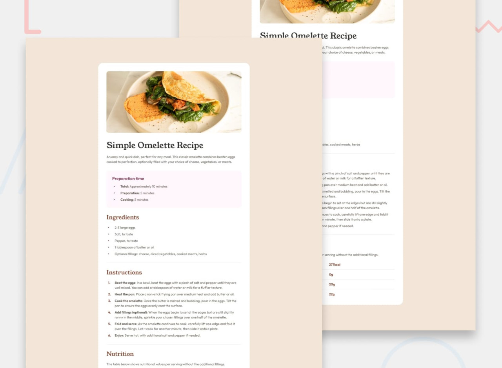

Recipe page
===
 

**Languages:** html,css  
**level:** newbie  
**description:**   
This challenge will help you focus on writing semantic HTML. Ensure you think  
through what HTML elements are most appropriate for each piece of content.  
